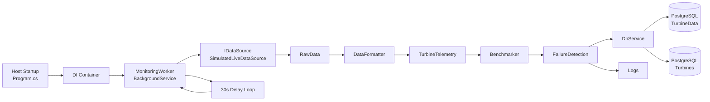

# Sprint 1 Prototype Design Document

## 1. Purpose
The Sprint 1 prototype is a backend monitoring pipeline that simulates wind-turbine telemetry, enriches it, performs basic failure indication, and stores results in PostgreSQL for later dashboard/API use.

## 2. Scope of the Prototype
- Simulate live turbine telemetry from either replayed CSV data or generative statistical models.
- Run a continuous worker loop to process one telemetry record per cycle.
- Apply lightweight formatting, benchmarking, and failure-detection steps.
- Persist telemetry and turbine status to the monitoring database.

## 3. Components and Interactions

### 3.1 Host Bootstrapping (`Program.cs`)
Purpose:
- Configures dependency injection (DI).
- Resolves DB connection string.
- Registers worker, data source, processing services, and EF Core context.
- Applies database migrations at startup.

Inputs:
- `appsettings.json` and optional `ConnectionStrings__MonitoringDb` environment variable.

Outputs:
- Running background service host.
- Migrated/updated PostgreSQL schema.

### 3.2 Data Source Layer (`DataSources/*`)
#### `IDataSource`
Purpose:
- Defines contract for data ingestion (`FetchAsync`).

Input/Output:
- Input: cancellation token.
- Output: one `RawData` sample.

#### `SimulatedLiveDataSource`
Purpose:
- Produces realistic telemetry in two modes:
  - Replay mode: cycles through `data/turbine1_clean.csv`.
  - Generative mode: synthesizes values from distribution/power-curve parameters.

Inputs:
- `SimulatedDataSource` config section (`Mode`, `TurbineCount`, replay path, generative parameters).

Outputs:
- `RawData` fields: `TurbineId`, `Timestamp`, `WindSpeed`, `ActivePower`, `RotorSpeed`, `PitchAngle`, `GearboxOilTemp`, `Vibration`, `Temperature`.

### 3.3 Processing Services (`services/*`)
#### `DataFormatter`
Purpose:
- Maps `RawData` into `TurbineTelemetry` base fields.

Input:
- `RawData`.

Output:
- `TurbineTelemetry` with turbine ID, timestamp, wind speed, rotor speed, and power output.

#### `Benchmarker`
Purpose:
- Adds a prototype `Efficiency` metric.

Input:
- `TurbineTelemetry`.

Output:
- Same telemetry with random `Efficiency` value.

#### `FailureDetection`
Purpose:
- Adds a prototype alert flag.

Input:
- `TurbineTelemetry`.

Output:
- Same telemetry with random `StartedAlert` boolean (30% probability).

### 3.4 Worker Orchestration (`Workers/MonitoringWorker.cs`)
Purpose:
- Orchestrates the end-to-end pipeline every 30 seconds.

Cycle steps:
1. Fetch one raw sample from `IDataSource`.
2. Convert and enrich telemetry values.
3. Run benchmark and failure detection.
4. Store telemetry and turbine status using scoped `DbService`.
5. Log cycle results.

Input:
- One `RawData` per loop.

Outputs:
- One persisted `TurbineTelemetry` row per loop.
- Updated/inserted `Turbine` row.
- Operational logs.

### 3.5 Persistence Layer (`database/MonitoringDbContext.cs`, `services/DbService.cs`, `Models/*`)
Purpose:
- Persist telemetry time-series and turbine summary state.

Entities used in Sprint 1 pipeline:
- `TurbineTelemetry` (`TurbineData` table)
- `Turbine` (lookup/status table)

`DbService` behavior:
- Upserts turbine (`Status` = `Alarm` if `StartedAlert=true`, else `Running`).
- Inserts telemetry record.
- Saves changes asynchronously.

## 4. Data Flow
1. Data source emits `RawData`.
2. Worker maps to `TurbineTelemetry`.
3. Worker enriches with extended values (vibration, temperature, pitch, gearbox oil temp).
4. Benchmark + failure detection annotate telemetry.
5. DB service writes turbine state and telemetry history.
6. Console/logger outputs cycle diagnostics.

## 5. User Experience (Current Prototype)
Current user interaction is developer/operator-centric (no direct end-user UI in this worker process):
- User starts the service with `dotnet run`.
- User configures source mode and simulation behavior in `appsettings.json`.
- User monitors logs to observe pipeline status.
- User queries PostgreSQL (or downstream API/dashboard) to inspect stored telemetry and alerts.

## 6. Architecture Diagram
The diagram is embedded below and also provided as a standalone source in `4_Development_and_QA/Sprint1_Architecture.mmd`.

## 7. Known Prototype Limitations
- Failure detection and efficiency scoring are random placeholders.
- Worker loop interval is hard-coded to 30 seconds in code.
- API/frontend integration is outside this worker service and not part of this Sprint 1 worker pipeline deliverable.
- Some model files are marked unused and should be cleaned in later sprints.

## 8. Planned Evolution (Next Sprint)
- Replace random alert logic with rule-based or ML inference.
- Replace random efficiency with calculated KPI.
- Make polling interval configurable via `Monitoring:IntervalSeconds`.
- Add integration tests for ingestion, processing, and persistence.
