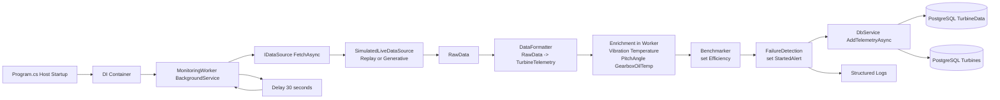

# COMP702 Wind Turbine Monitoring

.NET 8 worker service for wind turbine telemetry simulation, processing, and persistence.

## Overview

The service runs a continuous monitoring loop:

1. Fetch one telemetry sample from a simulated data source.
2. Format and enrich telemetry fields.
3. Calculate prototype metrics (`Efficiency`) and alert flag (`StartedAlert`).
4. Persist telemetry and turbine status to PostgreSQL.

## Current architecture

Main components:

- Worker: `COMP702-WindTurbine/Workers/MonitoringWorker.cs`
- Data source: `COMP702-WindTurbine/DataSources/SimulatedLiveDataSource.cs`
- Processing services:
  - `COMP702-WindTurbine/services/DataFormatter.cs`
  - `COMP702-WindTurbine/services/Benchmarker.cs`
  - `COMP702-WindTurbine/services/FailureDetection.cs`
- Persistence:
  - `COMP702-WindTurbine/database/MonitoringDbContext.cs`
  - `COMP702-WindTurbine/services/DbService.cs`



## Database tables

- Turbines
- TelemetryHistories
- Alerts
- WorkerStatuses
- WorkerMetrics

## Alert lifecycle

`Active -> Acknowledged -> Resolved -> Cleared`

Current worker behavior:

- Auto create `Active` when vibration > 8
- Auto resolve when vibration recovers
- Auto clear resolved alerts after configured hours
  Standalone diagram source:
- `4_Development_and_QA/Sprint1_Architecture.mmd`

## Data source modes

Configured in `COMP702-WindTurbine/appsettings.json` under `SimulatedDataSource`:

- `Mode = Replay`: read from `data/turbine1_clean.csv`.
- `Mode = Generative`: synthesize samples from configured distributions and power curve parameters.
- `TurbineCount`: number of simulated turbine IDs (`WT-001`, `WT-002`, ...).

## Configuration

- Connection string:
  - Environment variable `ConnectionStrings__MonitoringDb` (recommended), or
  - `ConnectionStrings:MonitoringDb` in `appsettings.json`
- Monitoring loop:
  - Worker currently delays `30` seconds between cycles in code (`MonitoringWorker.cs`).

  # Wind Fault Detection Service

      ## Overview

        - This is a failure prediction machine learning service for the wind turbine fault detection project.

        - The Python service is now used for training only. It trains a kNN model to predict the target variable, such as gearbox oil temperature.

        - Live prediction, residual calculation, EWMA chart logic, A1/A2 alarm evaluation, and saving failure results are now handled in the .NET project

        ---

      ## Setup the virtual environment / run in terminal one by one

        1:
        - cd faultDetection_service

        2:
        - python -m venv .venv

        "or"

        - py -m venv .venv

        - Activate it

        3:
        - .venv\Scripts\Activate

        "or for mac"

        - source .venv/bin/activate

        Install dependencies

        4:
        - pip install -r requirements.txt

        "or for mac"

        - python -m pip install -r requirements.txt


        ---

      ## Run - You need to do this every time you open VS

        1:
        - cd faultDetection_service

        2:
        - .venv\Scripts\Activate

        "or for mac"

        e.g

        - py -m training.model_trainer

      ## Training

        - for training you will use trining/model_trainer

        upload the data in data/trainingReady

        and run:
        py -m training.model_trainer

        after training a . pkl model and .onnx model will be generated in artifacts/fianl Model converted in addition to metadata.json

        - If you trained new model. you want to copy the new .onnx trained model and the metadata.json to .NET in COMP702-WindTurbine/

        TrainedModel for .NET to use them for predicition

      ## Configuration

        Controlled via JSON settings:
        faultDetection_service/app/config/mode_settings.json

        target column
        feature columns
        model type, such as kNN
        training parameters
        random state

        Important:

        Training and prediction must use the same feature columns.
        Feature order must stay consistent between Python training and .NET prediction.

        ---

      ## Prediction

        - Prediction is not handled by Python anymore

        - Prediction is now handled in the .NET project. by COMP702-WindTurbine/services/FailureDetection.cs

        - The .NET project:

        Loads the trained/exported model
        Predicts the expected target value
        Computes residual:

        residual = actual − predicted

        Applies EWMA for anomaly detection Generates alarm levels:
        A1 -> threshold exceeded
        A2-> repeated A1 triggers
        -Saves failure detection results to the database

        ---

       ## Notes

        - Python is used for training only.
        - NET is used for prediction and alarm evaluation.
        - Training and prediction must use consistent feature columns.
        - The trained model metadata should be saved and used to confirm the feature order.

## Run

```bash
dotnet build
dotnet run --project COMP702-WindTurbine/COMP702-WindTurbine.csproj
```

## Current limitations

- `Benchmarker` and `FailureDetection` use random prototype logic.
- Monitoring interval is hardcoded to 30 seconds in worker code.
- This project focuses on backend pipeline; UI/API consumption is separate.
