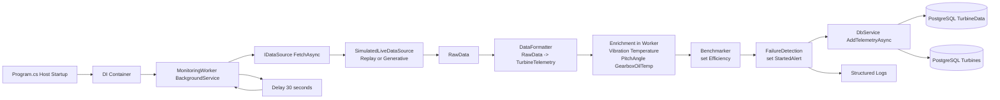

# COMP702 Wind Turbine Monitoring

.NET 8 worker service for wind turbine telemetry simulation, processing, and persistence.

## Overview
The service runs a continuous monitoring loop:
1. Fetch one telemetry sample from a simulated data source.
2. Format and enrich telemetry fields.
3. Calculate prototype metrics (`Efficiency`) and alert flag (`StartedAlert`).
4. Persist telemetry and turbine status to PostgreSQL.

## Current architecture
Main components:
- Worker: `COMP702-WindTurbine/Workers/MonitoringWorker.cs`
- Data source: `COMP702-WindTurbine/DataSources/SimulatedLiveDataSource.cs`
- Processing services:
  - `COMP702-WindTurbine/services/DataFormatter.cs`
  - `COMP702-WindTurbine/services/Benchmarker.cs`
  - `COMP702-WindTurbine/services/FailureDetection.cs`
- Persistence:
  - `COMP702-WindTurbine/database/MonitoringDbContext.cs`
  - `COMP702-WindTurbine/services/DbService.cs`



Standalone diagram source:
- `4_Development_and_QA/Sprint1_Architecture.mmd`

## Data source modes
Configured in `COMP702-WindTurbine/appsettings.json` under `SimulatedDataSource`:
- `Mode = Replay`: read from `data/turbine1_clean.csv`.
- `Mode = Generative`: synthesize samples from configured distributions and power curve parameters.
- `TurbineCount`: number of simulated turbine IDs (`WT-001`, `WT-002`, ...).

## Configuration
- Connection string:
  - Environment variable `ConnectionStrings__MonitoringDb` (recommended), or
  - `ConnectionStrings:MonitoringDb` in `appsettings.json`
- Monitoring loop:
  - Worker currently delays `30` seconds between cycles in code (`MonitoringWorker.cs`).

## Run
```bash
dotnet build
dotnet run --project COMP702-WindTurbine/COMP702-WindTurbine.csproj
```

## Current limitations
- `Benchmarker` and `FailureDetection` use random prototype logic.
- Monitoring interval is hardcoded to 30 seconds in worker code.
- This project focuses on backend pipeline; UI/API consumption is separate.
