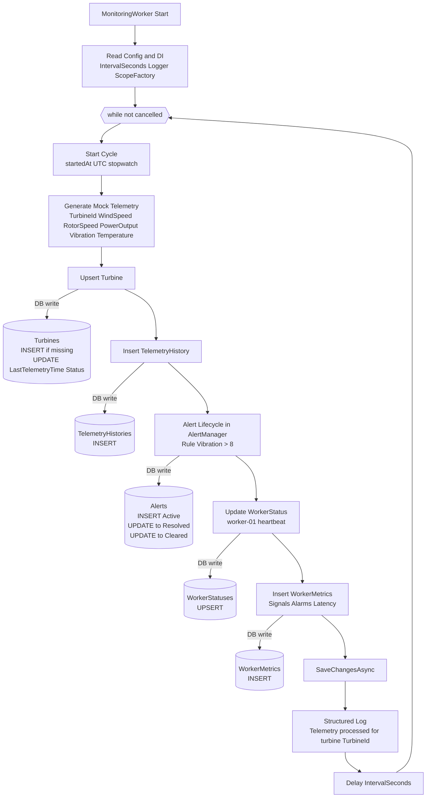

# COMP702 Wind Turbine Monitoring

.NET 8 Worker Service for wind turbine monitoring.

## Current architecture

Monitoring loop:

Input -> DataFormatter -> Prediction -> Alert Lifecycle -> Database

Main components:

- Worker: `Workers/MonitoringWorker.cs`
- Alert lifecycle: `Alerting/AlertManager.cs`
- EF Core DbContext: `Infrastructure/MonitoringDbContext.cs`
- Models: `Models/*`



## Database tables

- Turbines
- TelemetryHistories
- Alerts
- WorkerStatuses
- WorkerMetrics

## Alert lifecycle

`Active -> Acknowledged -> Resolved -> Cleared`

Current worker behavior:

- Auto create `Active` when vibration > 8
- Auto resolve when vibration recovers
- Auto clear resolved alerts after configured hours

## Configuration

`appsettings.json`

- `Monitoring:IntervalSeconds` (default 5)
- `Monitoring:AlertAutoClearHours` (default 24)

## Run

```bash
dotnet build
dotnet run --project COMP702-WindTurbine
```

## Team collaboration

- Use feature branches: `feature/<name>`
- Open PRs to `main`
- Keep PRs focused and small

# training & Testing (Quick Guide)

1. Add Raw Data

Put CSV files in:

faultDetection_service/training/rawData/ 2. Clean Data

Run:

python trainingDataCleaning.py

Cleaned files will be saved in:

faultDetection_service/training/cleanData/ 3. Train Model

Run:

py -m training.Training_Model_Pipeline

Model will be saved in:

artifacts/<TURBINE_ID>/model.pkl 4. Test Prediction

Run:

python scripts/test_prediction.py

This will load the model and test it on sample data.
